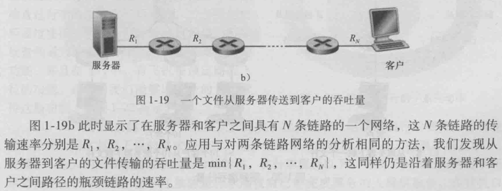

# 计算机网络第一次作业

PB18000227 艾语晨

## 第一章

### P6

> 传播时延指一个 bit 在链路中传输所用的时间，而传输时延指一个分组全部发出所用的时间

1. $d_{prop}=\frac m s$
2. $d_{trans}=\frac L R$
3. 由于没有中间结点并忽略处理和排队时延，$d_{end-end}=d_{trans}+d_{prop}=\frac L R+\frac m s$
4. 主机A的出口处
5. 在A和B之间的链路上
6. 已经到达主机B，在B的缓存区中
7. $\frac m s=\frac L R,\quad therefore\quad m=s\times\frac L R=5.36\times10^5meters$

### P10

分组的端到端时延为
$$
\begin{aligned}
d_{end-end}&=d_{proc}+\sum_{i=1}^3(d_{trans}+d_{prop})\\
&=d_{proc}+\sum_{i=1}^3(\frac L {R_i}+\frac{d_i}{s_i})
\end{aligned}
$$
对于这些数据，端到端时延为
$$
\begin{aligned}
d_{end-end}&=3ms+((\frac{1500\times8}{2\times10^6}+\frac{5\times10^6}{2.5\times10^8})+(\frac{1500\times8}{2\times10^6}+\frac{4\times10^6}{2.5\times10^8})+(\frac{1500\times8}{2\times10^6}+\frac{1\times10^6}{2.5\times10^8}))s\\
&=61ms
\end{aligned}
$$

### P22

设随机事件A为在一次传输中，客户成功接收该分组，则 $P(A)=(1-p)^n$。每一次传输视为一次伯努利实验，设随机变量X为第一次传输成功出现时，传输发生的次数，则X服从几何分布，即 $X\sim G((1-p)^n)$，故其期望为 $\frac1{(1-p)^n}$。重传不包括第一次传输，故重传次数的期望为 $\frac1{(1-p)^n}-1$

## 第二章

### P1

1. 错，对于三幅图片都需要
2. 正确，他们都在同一个服务器上面，可以用同一个TCP链接发送
3. 错，非持续连接会使server在发出应答报文之后断开连接，故只能携带一个请求报文
4. 错
5. 错

### P3

应用层：DNS和HTTP

运输层：TCP和UDP

### P7

分为获取URL的IP地址和用TCP传输数据两部分，前者的时间为
$$
\sum_{i=1}^nRTT_i
$$
后者的时间为两个 $RTT_0$（即建立连接和请求数据），故总时间为：
$$
2RTT_0+\sum_{i=1}^nRTT_i
$$

