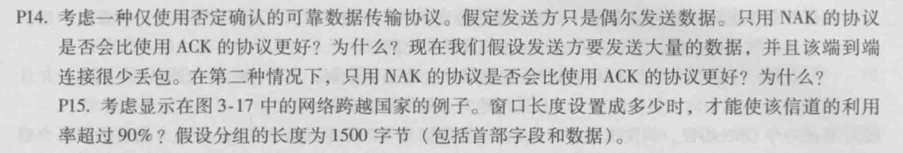
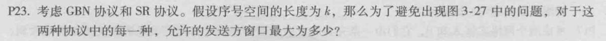
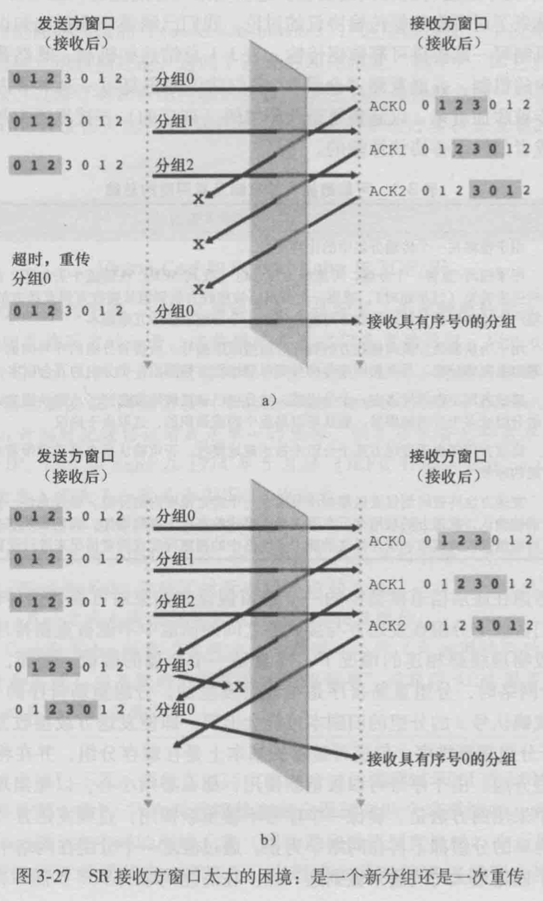
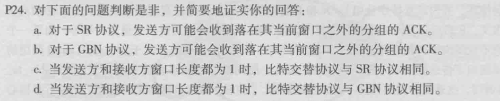
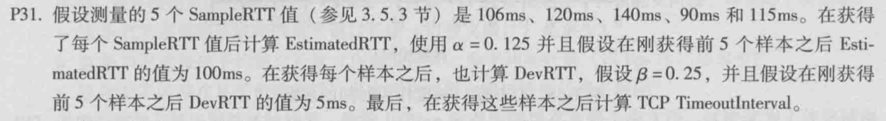
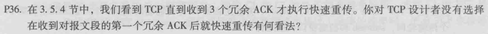
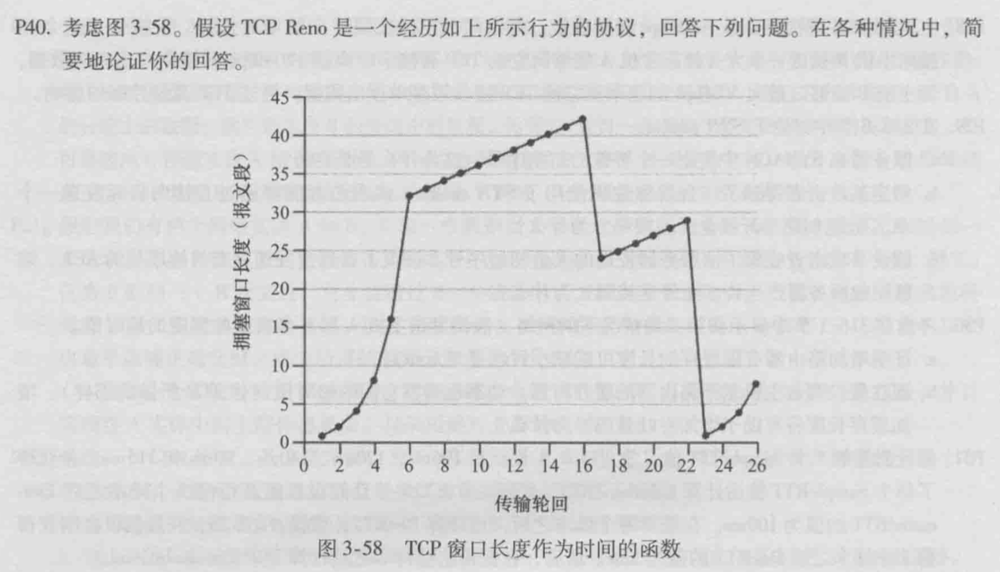
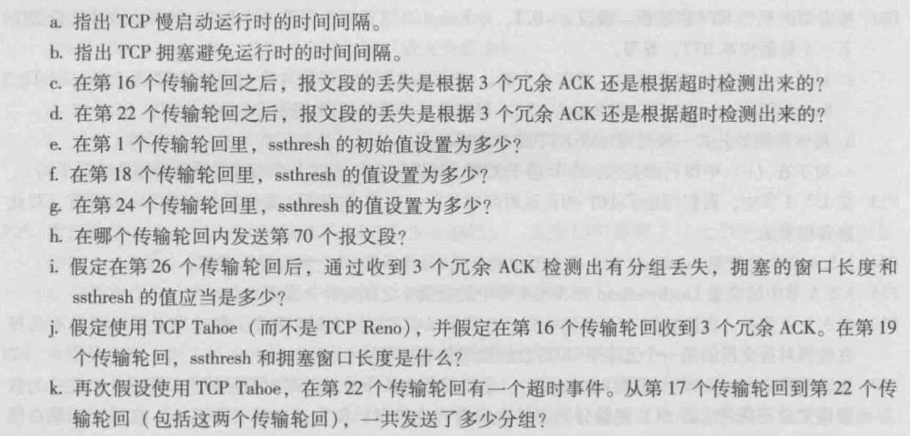
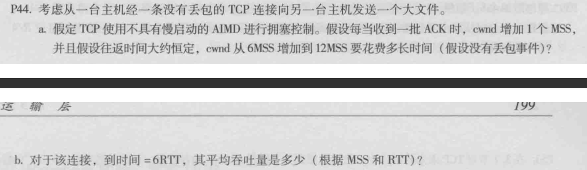

# 计算机网络第二次作业

## Ch3 P14

不是。因为若只用NAK，只有当接收方接收到第 n-1​ 和第 n+1 个分组时，才会判定第 n​ 个分组丢失，但是由于偶尔发送数据，故第 n​ 个分组和第 n+1 个之间可能会有很大的延迟。这时发送方就一直接受不到分组未到达的反馈。

是。因为如果不用ACK，那么节省了大量接收方发送ACK的带宽和时间，因为只需要发送NAK即可，而NAK又是概率很低的。

## Ch3 P23

观察困境产生的原因，即发送方两个窗口范围内，由于出现了两组序列号相同的分组，导致接收方无法识别是重传分组还是新发过来的分组。故为了避免这个问题，序列号应当至少是发送方/接收方窗口宽度的两倍，即窗口长度最大为 $2^{k-1}$

## Ch3 P24

### a

正确。

如上面这个图所示，在A时刻sender发出第一个窗口的数据（不妨设为分组1到k），在B时刻sender由于超时重传第一个窗口，而当C时刻center收到了receiver反馈回来的ACK信号，并将窗口向后移动，发出第 k+1 个分组。当到达D时刻时，receiver响应B时刻重传的1号分组的ACK到达sender，但此时1号分组已经不在窗口里面了。

### b

正确。

上面所述情况对GBN协议仍然成立

### c

当窗口长度为1的时候，传输没有并行，变为一个停等协议，故不存在乱序到达的可能性。于是SR协议变为一个比特交替协议

### d

当窗口长度为1的时候，传输没有并行，变为一个停等协议，故不存在乱序到达的可能性。于是GBN协议变为一个比特交替协议

## Ch3 P31

$EstimatedRTT=(1-\alpha)EstimatedRTT+\alpha SampleRTT,\quad\alpha=0.125$

$DevRTT=(1-\beta)DevRTT+\beta\mid SampleRTT-EstimatedRTT\mid,\quad\beta=0.25$

在下面的求解过程中，$EstimatedRTT$ 简写为 ER，$DevRTT$ 简写为 DR

### 1

ER=0.875\*100+0.125\*106=100.75ms

DR=0.75\*5+0.25\*|106-100.75|=5.0625ms

### 2

ER=0.875\*100.75+0.125\*120=103.15625

DR=0.75\*5.0625+0.25\*|120-103.15625|=8.0078125

### 3

ER=0.875\*103.15625+0.125\*140=107.76171875

DR=0.25\*|140-107.76171875|+0.75\*8.0078125=14.0654296875

### 4

ER=0.875\*107.76171875+0.125\*90=105.54150390625

DR=0.75\*14.0654296875+0.25\*|105.54150390625-90|=14.43444824219

### 5

ER=0.875\*105.54150390625+0.125\*115=106.72381591797

DR=0.75\*14.43444824219+0.25\*|115-106.72381591797|=12.89488220215

$TimeoutInterval=EstimatedRTT+4\cdot DevRTT=158.30334472657$

## Ch3 P36

（这题说的很模糊，意思应该是：sender在发出 n-1 包后，收到三个ACK(n)才重传，而不是收到两个ACK(n)就重传）

因为收到两个ACK(n)有可能是因为乱序。

TCP的工作原理是，当receiver收到编号为 n-1 的包之后，发出 ACK(n)。只要没有接收到编号为 n 的，就一直发送 ACK(n)。所以说，如果在传输过程中，编号为 n 的和编号为 n+1 的包调换了位置，那么sender会接收到两个ACK(n)，但实际上这时还是可以接受的，而如果接收到三个ACK(n)，那大概率就是丢包了。

## Ch3 P40

TCP Reno使用了快速恢复，而TCP Tahoe无条件地将拥塞窗口减至1个MSS

### a

1~6, 23~26

### b

6~16, 17~22

### c

冗余ACK（因为窗口大小没有被重置为1）

### d

超时（重口大小被重置为1）

### e

由于是刚开始，ssthresh被设置为窗口大小 $2^5=32$

### f

因为有过冗余ACK，所以ssthresh被设置成cwnd的一半，即 42/2=21

### g

此次慢启动的ssthresh被设定为丢包之前cwnd的一半（向下取整），即 29/2=14

### h

第七个传输轮回

### i

收到三个冗余的ACK，ssthresh的值置为cwnd的一半，即 $2^3/2=4$，而cwnd需要减半再加上3，即 $2^3/2+3=7$

### j

TCP Tahoe将cwnd减至1，并进入慢启动状态，这时ssthresh的值为原来cwnd的一半，即21

### k

$1+2+4+8+16+21=52$

## Ch3 P44

### a

每增加一个MSS都需要一个RTT，所以共需要第6个RTT，在第六个 RTT结束的时候cwnd增加到12MSS

### b

平均吞吐量为
$$
\frac{6+7+8+9+10+11}{6}=8.5MSS/RTT
$$
